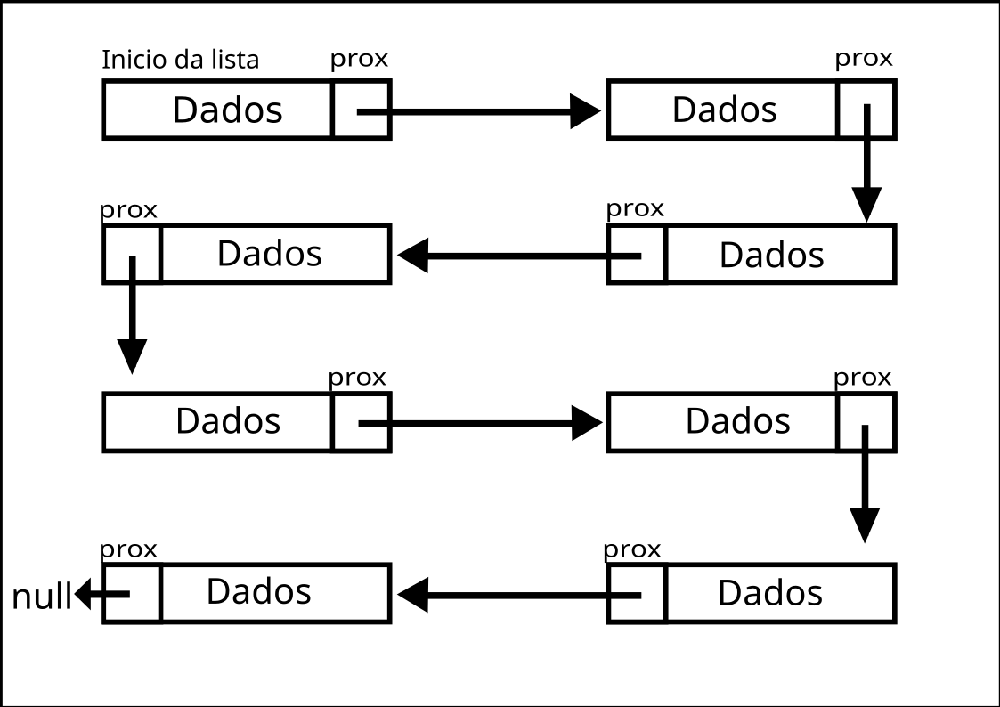

# Lista Dinamicamente Digada
### Autor: Pedro Henrique S. Pires  Email: pedropires2603@gmail.com
 

## Conceito de uma lista dinâmica
Uma lista dinâmica é constituída por um objeto que armazena um certo tipo de dado e aponta para um outro objeto, do mesmo tipo, com outros dados, formando assim uma espécie de vetor, porém sem índice, diferente da lista simplesmente ligada. 
Da mesma maneira que a lista simples deste mesmo repositório, essa lista é composta pelos dados de uma pessoa, que são: nome e idade. A lista é bem simples, pois foi feita para fins de atestar conhecimentos, mas pode ser ampliada para guardar endereço, número de celular, trabalho, formações, cpf e quaisquer outros dados relacionados a uma pessoa. 
  

## Representação de uma lista dinâmica
Imagem: Lista dinamicante ligada 
  
Nessa imagem, podemos observar os elementos da lista dinâmica, como:
1. Cada retângulo é um objeto lista e cada um aponta para o próximo objeto lista, onde a referência para o próximo objeto é representado na figura por um quadrado com a seta; 
2. O último objeto aponta para null, indicando o fim da lista.
  

## Funções básicas de uma lista
* Criar a lista. Neste exemplo, não fiz essa função, pois o próprio construtor do objeto faz esse papel;
* Excluir: remove a lista da memória;
* Verificações: se a lista está vazia ou cheia;
* Consultas: quantidade de objetos na lista e, para esse exemplo, uma busca pelo nome.
* Inserções: inserir dado no início, meio e fim da lista;
* Remoções: remover dado do início, meio e fim da lista;
* Imprimir cada elemento da lista.

### Como rodar os códigos no seu PC com Linux.
Os códigos foram desenvolvidos na versão 8.0.3 do PHP. Não é necessário ser a versão exata, mas pode ocorrer alguns problemas com funções em versões muito anteriores 
1. Com o PHP instalado, pelo terminal baixe com "git clone" o repositório na sua máquina (irá baixar todo o repositório, mas só será usada a pasta "listaEstatica"; 
2. Entre na pasta "listaEstatica"; 
`cd EstruturasDeDadosPHP/1\ -\ listaLigada/` 
3. Execute o arquivo "main.php" 
`php main.php`

O arquivo "main.php" é um arquivo criado por mim para facilitar os testes. 