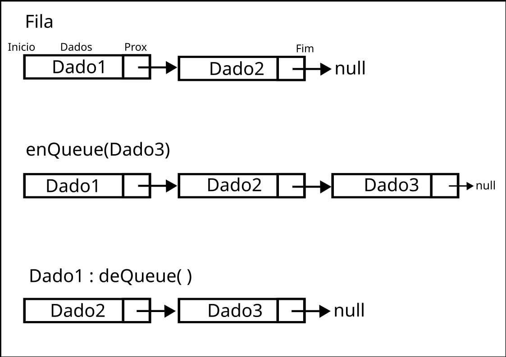

# Fila
### Autor: Pedro Henrique S. Pires  Email: pedropires2603@gmail.com
 

## Conceito de uma fila
Uma fila é basicamente uma lista onde o primeiro que chega é o primeiro que sai. Funciona exatamente como uma fila de banco, por exemplo, onde quem chega por último tem que esperar os que chegaram primeiro ser atendido. A implmentação usada como base para esta fila é a lista genérica, todas as funções foram copiadas e foram feitas as devidas modificações para funcionar como uma fila. Existem apenas duas diferenças: as funções enQueue e deQueue, que são as funções de adicionar no final e remover no início, respectivamente. 
  

## Representação de uma fila
Imagem: Fila 
  
Nessa imagem, podemos observar os elementos da fila, como:
1. A fila em si, com dois elementos "Dado1 e Dado 2;
2. O início e o fim da fila
3. Ao executar um enQueue(Dado3), o elemento "G" será adicionado no fim da fila;
4. O elemento que está no fim será o último a ser removido, ou seja, o elemento "Dado3", que acabou de ser inserido;
5. Naturalmente, o elemento do início será o primeiro a ser removido, como visto na terceira fila, onde executar um deQueue(), a função remove e retorna o elemento "Dado1".
6. Ao executar um outro deQueue(), retornaria o elemento "Dado2" e assim por diante, até a fila ficar vazia.
  

## Funções básicas da fila
* Excluir fila: remove a fila da memória;
* Verificações: se a fila está vazia ou cheia;
* Consultas: quantidade de objetos na fila;
* enQueue: inserir dados no fim da fila;
* deQueue: remover dados do início;
* Imprimir cada elemento da fila.

### Como rodar os códigos no seu PC com Linux.
Os códigos foram desenvolvidos na versão 8.0.3 do PHP. Não é necessário ser a versão exata, mas pode ocorrer alguns problemas com funções em versões muito anteriores 
1. Com o PHP instalado, pelo terminal baixe com "git clone" o repositório na sua máquina (irá baixar todo o repositório, mas só será usada a pasta "listaEstatica"; 
2. Entre na pasta "listaEstatica"; 
`cd EstruturasDeDadosPHP/2\ -\ fila/` 
3. Execute o arquivo "main.php" 
`php main.php`

O arquivo "main.php" é um arquivo criado por mim para facilitar os testes. 