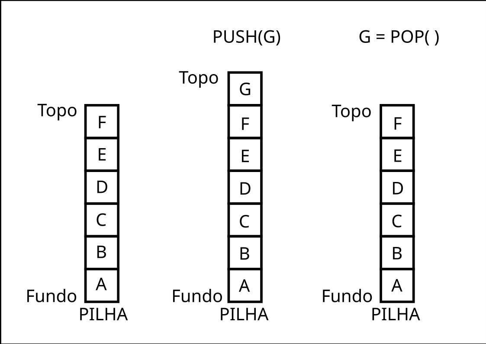

# Pilha
### Autor: Pedro Henrique S. Pires  Email: pedropires2603@gmail.com
 

## Conceito de uma pilha
Uma pilha é basicamente uma lista onde só podemos inserir e remover no final. A implmentação usada como base para esta pilha é a lista genérica, todas as funções foram copiadas e foram feitas as devidas modificações para funcionar como uma pilha. Existem apenas duas diferenças: as funções push e pop, que são as funções de adicionar no final e remover no final, respectivamente. 
  

## Representação de uma pilha
Imagem: Pilha 
  
Nessa imagem, podemos observar os elementos da pilha, como:
1. A pilha em si, com os elementos representados de A até F;
2. O fundo e o topo da pilha;
3. Ao executar um push(G), o elemento "G" será adicionado ao topo;
4. O elemento que está no fundo será o último a ser removido, ou seja, o elemento "A";
5. Naturalmente, o elemento do topo será o primeiro a ser removido, como visto na terceira pilha, onde executar um pop(), a função remove e retorna o elemento "G".
6. Ao executar um outro pop(), retornaria o elemento "F" e assim por diante, até a pilha ficar vazia.
  

## Funções básicas da pilha
* Excluir pilha: remove a pilha da memória;
* Verificações: se a pilha está vazia ou cheia;
* Consultas: quantidade de objetos na pilha;
* push: inserir dado no topo;
* pop: remover dado do topo;
* Imprimir cada elemento da pilha.

### Como rodar os códigos no seu PC com Linux.
Os códigos foram desenvolvidos na versão 8.0.3 do PHP. Não é necessário ser a versão exata, mas pode ocorrer alguns problemas com funções em versões muito anteriores 
1. Com o PHP instalado, pelo terminal baixe com "git clone" o repositório na sua máquina (irá baixar todo o repositório, mas só será usada a pasta "listaEstatica"; 
2. Entre na pasta "listaEstatica"; 
`cd EstruturasDeDadosPHP/3\ -\ pilha/` 
3. Execute o arquivo "main.php" 
`php main.php`

O arquivo "main.php" é um arquivo criado por mim para facilitar os testes. 