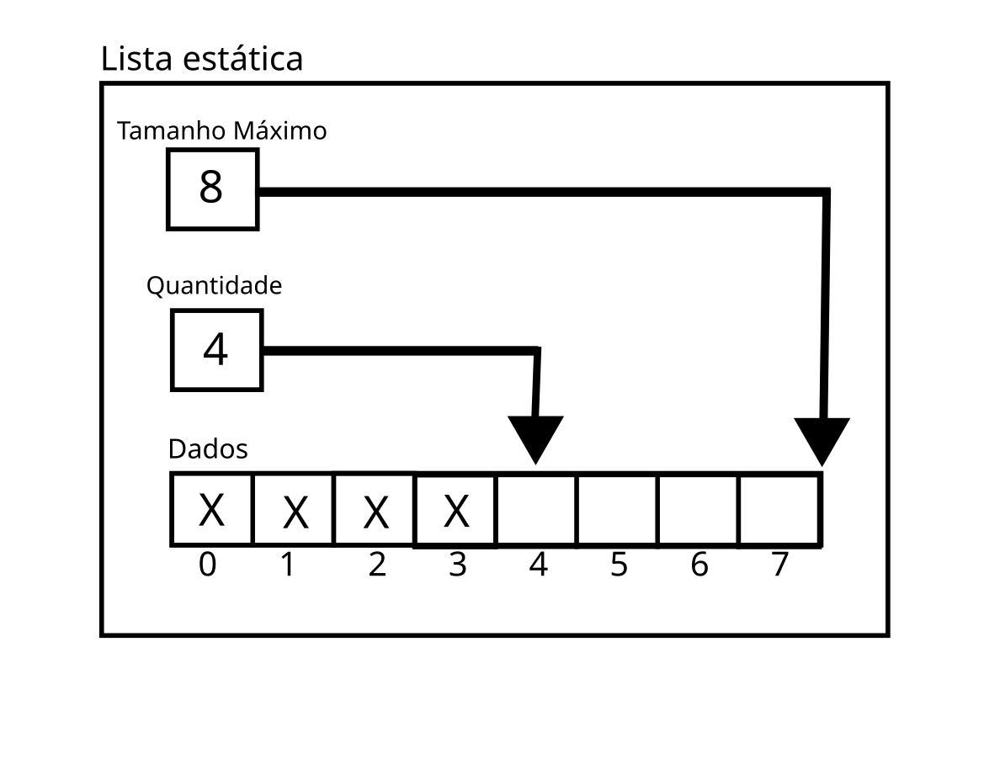

# Lista simples ou lista sequencial estática
### Autor: Pedro Henrique S. Pires  Email: pedropires2603@gmail.com
 

## Conceito de uma lista sequencial estática
Básicamente, uma lista é um objeto que consegue guardar, literalmente,
uma lista de outros objetos. 
Como exemplo, a lista do repositório é composta pelos dados de uma pessoa, que são: nome e idade. A lista é bem simples, pois foi feita para fins de atestar conhecimentos, mas pode ser ampliada para guardar endereço, número de celular, trabalho, formações, cpf e quaisquer outros dados relacionados a uma pessoa. 
Uma lista sequencial estática é um objeto como descrito anteriormente, o que muda entre as listas é como ela armazena e trata destes elementos. A lista em questão, armazena seus dados em um vetor e tem um tamanho máximo estipulado. Veja a representação da lista estática a seguir.
  

## Representação de uma lista estática
Imagem: Lista Estática  
  
Nessa imagem, podemos observar os elementos da lista sequencial estática, como:
1. O próprio objeto lista (quadrado maior que engloba todos os outros);
2. O tamanho total da lista (Tamanho Máximo) de 8 elementos, ou seja, apenas 8 elementos podem ser adicionados na lista ao total.
3. A quantidade de elementos (Quantidade) dentro da lista. Como o PHP utiliza o zero como início de um vetor, a variável "Quantidade" é usada também para indicar o próximo local vazio na lista. Quando "Quantidade" é igual a "Tamanho Máximo", indica que não pode ser adicionado mais elementos.
4. E o vetor de dados (Dados) em si, com um "X" nas posições já ocupadas. Este vetor pode ser de qualquer tipo básico do PHP (int, bool, etc), ou de objetos, como usado na lista desse repositório.
  

## Funções básicas de uma lista
* Criar a lista. Neste exemplo, não fiz essa função, pois o próprio construtor do objeto faz esse papel;
* Excluir: remove a lista da memória;
* Verificações: se a lista está vazia ou cheia;
* Consultas: quantidade de objetos na lista e, para esse exemplo, uma busca pelo índice de um nome.
* Inserções: inserir dado no início, meio e fim da lista;
* Remoções: remover dado do início, meio e fim da lista;
* Imprimir cada elemento da lista.

### Como rodar os códigos no seu PC com Linux.
Os códigos foram desenvolvidos na versão 8.0.3 do PHP. Não é necessário ser a versão exata, mas pode ocorrer alguns problemas com funções em versões muito anteriores 
1. Com o PHP instalado, pelo terminal baixe com "git clone" o repositório na sua máquina (irá baixar todo o repositório, mas só será usada a pasta "listaEstatica"; 
2. Entre na pasta "listaEstatica"; 
`cd Estruturas_de_Dados_PHP/listaEstatica/` 
3. Execute o arquivo "main.php" 
`php main.php`

O arquivo "main.php" é um arquivo criado por mim para facilitar os testes. 
